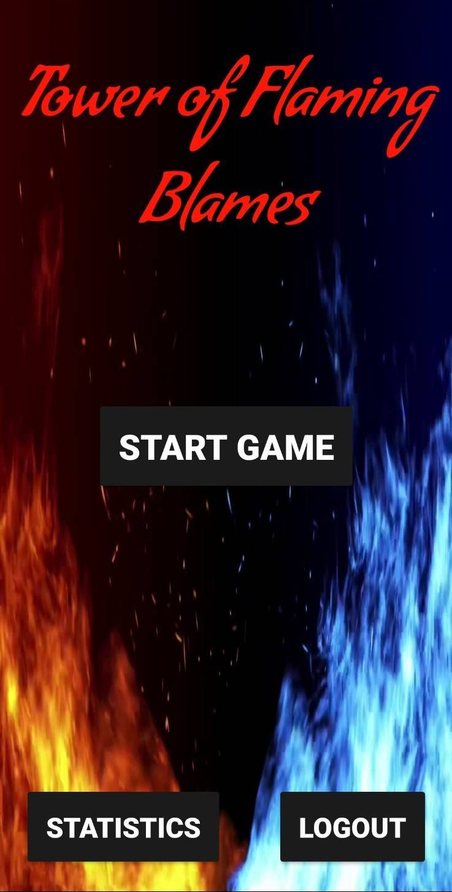
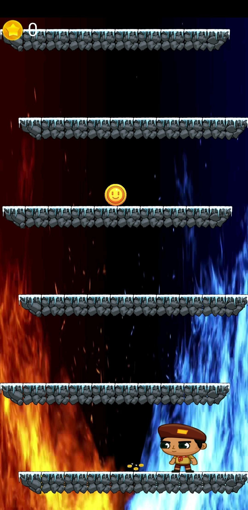

# Tower of flaming blames | 2021

## O Projekcie
**Tower of blaming flames** *(ToFB)* to platformowa gra napisana w Android Studio, wzorowana na popularnej grze Icy Tower. 
Celem bohatera jest zdobycie jak największej liczby monet, zanim zostanie strawiony przez ,,płonące winy'', czyli postać przekroczy dolną krawędź telefonu.
Dodatkowo są dostępne trzy boostery pojawiające się w trakcie rozgrywki:
  - *stos monet* - liczba monet i boosterów pojawiających się na mapie zwiększa się przez pewien czas,
  - *klepsydra* - zwalnia prędkość platform przez pewien czas,
  - *trąba powietrzna* - wydłuza długość skoku bohatera przez pewien czas.

Sterowanie odbywa się za pomocą przechylania telefonu, a skakanie poprzez dotknięcie ekranu. 

Użytkownik ma  możliwość założenia konta. Aplikacja wykorzystuje bazę danych Firebase, dzięki ktorej gracz ma dostęp do najlepszych wyników innych zalogowanych graczy, ale rownież widzi statystyki dotyczące jego ostatnich gier.

 

